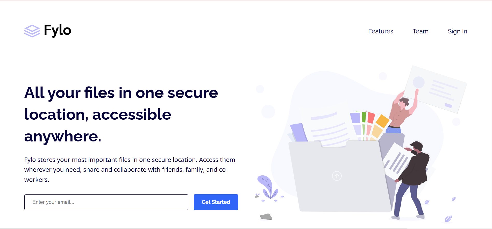

#   👨‍💻 Lucien Hussein

    

    
    
    

    
    

##   🚀 About Me

-   🔭 I'm currently working on building my skills as a **Junior Frontend Developer**
-   🌱 I'm learning **Fullstack Development** fundamentals
-   👯 Looking to collaborate on: beginner-friendly open-source projects and web applications
-   🤔 Seeking mentorship in coding best practices and debugging techniques
-   💬 Ask me about my learning journey and web development progress
-   📫 Reach me at: [LinkedIn](https://www.linkedin.com/in/lucien-hussein-4878052b6/) or [husseinlucien7@gmail.com](mailto:husseinlucien7@gmail.com)
-   ⚡ Fun fact: I'm a big fan of sci-fi movies

##   🛠️ Skills

    <h3>Languages</h3>
    
    
    
    <h3>Frameworks & Libraries</h3>
    
    
    <h3>Tools & Technologies</h3>
    
    
    
    

##   📂 Projects

  <h3>Huddle Landing Page</h3>
  
  

    
    
  

  <h3>Grid Landing Page</h3>
  
  

    
    
  

  <h3>Fylo Landing Page</h3>
  
  

    
    
  

##   🌱 Learning Journey

    

-   Currently focusing on strengthening my JavaScript fundamentals
-   Learning responsive design principles
-   Exploring basic React concepts
-   Working on improving my problem-solving skills through coding challenges

##   📊 GitHub Activity

    

##   📫 Connect with Me

    
    

---

    
    
Thank you for visiting my profile! I'm at the beginning of my development journey and excited to learn and grow! 😊

